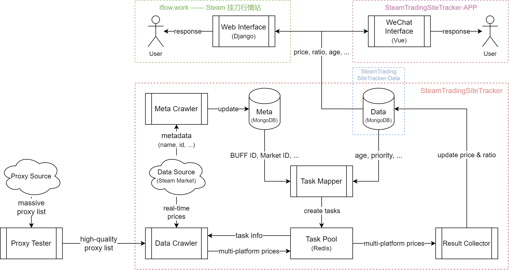

# SteamTradingSiteTracker

Steam 挂刀行情站 —— 全天候更新的 BUFF & IGXE & C5 & UUYP 挂刀比例数据

> For a description of this project in English, please refer to the [project wiki](https://github.com/EricZhu-42/SteamTradingSiteTracker/wiki)

## 更新公告

[2024/04/03] 新增了 “近期成交” 比例的显示功能，表示以 Steam Market 24 小时内交易价格中位数的价格卖出后的挂刀比例，详见：[#48](https://github.com/EricZhu-42/SteamTradingSiteTracker/issues/48)

[2024/02/18] 我们的 [饰品数据 API](https://flowus.cn/share/6fbcab3d-4e7b-42c5-9a8c-918f9ce90b5e) 正式发布

## 饰品 ID 映射表

我们发布了一份 DOTA2 & CS2 饰品在 Steam Market 与第三方交易平台的 ID 对照表：[SteamTradingSite-ID-Mapper](https://github.com/EricZhu-42/SteamTradingSite-ID-Mapper).

We are glad to release an ID mapping for DOTA2 & CS2 tradeable items between the Steam Market and major trading platforms: [SteamTradingSite-ID-Mapper](https://github.com/EricZhu-42/SteamTradingSite-ID-Mapper).

## ~~站点监控面板上线公告~~

~~我们部署了基于 Grafana 的**站点状态监控面板**，访问地址：**[monitor.iflow.work](https://monitor.iflow.work/)**~~

~~我们公开站点的监控数据，既是为了让普通用户能够更直观地了解站点饰品数据的更新速度及过程，也是希望能够为感兴趣的开发者提供参考，以设计更高效的 Steam 饰品价格数据监测系统。~~

## 新版 UI 发布公告
:tada: 由 [@Lazycce](https://github.com/lazycce) 开发的站点新版 UI 已经上线测试，访问地址：[**steam.iflow.work**](https://steam.iflow.work)

**近期将对新版 UI 进行进一步的优化**，期间可能短时间出现服务无法使用的情况，请谅解。

与 UI 相关的意见或建议请通过 [Issue](https://github.com/EricZhu-42/SteamTradingSiteTracker/issues) 反馈。

## 项目信息

:star: **站点访问地址：[https://www.iflow.work/](https://www.iflow.work/)** :star:（服务器位于香港，部分网络环境下可能无法正常访问）

**24小时持续更新饰品比例数据及走势**，目前追踪 **BUFF & IGXE & C5 & UUYP** 四个主要平台售价大于 1 元，满足特定筛选规则的 **CSGO & DOTA2** 饰品皮肤（具体规则由[数据分析](https://github.com/EricZhu-42/SteamTradingSiteTracker-Data/blob/main/SteamBuffSnapshot/demo.ipynb)得到）。列表动态更新，当前饰品数约 16000 个。

目前重点物品数据约 **40min** 更新一次。

## 项目架构

## 数据集

该项目获得的历史饰品价格信息数据可于 [SteamTradingSiteTracker-Data](https://github.com/EricZhu-42/SteamTradingSiteTracker-Data) 获取，具体数据集包括：

- [DataDumps](https://github.com/EricZhu-42/SteamTradingSiteTracker-Data/tree/main/DataDumps)：2022/04/25 ~ 当天 7 天前的 DATA 数据库完整存档
- [SteamBuffSnapshot](https://github.com/EricZhu-42/SteamTradingSiteTracker-Data/tree/main/SteamBuffSnapshot)：2022/02/14 期间，BUFF 平台 dota2 与 csgo 所有饰品的价格数据，及对应的 Steam Market 数据；还包含一个基于历史数据，获取低比例饰品池筛选规则的 python demo

## 移动端 APP

站点 APP 端（微信小程序）由 [@Lazycce](https://github.com/lazycce) 开发维护，详见：[SteamTradingSiteTracker-APP](https://github.com/lazycce/SteamTradingSiteTracker-APP)

APP 端与网页端数据同步，可以在各种网络环境下正常访问

## 其他信息

更新日志、开发计划等其他信息请参考我们的 [项目主页](https://flowus.cn/share/139253e9-cd71-43c7-9619-b23e6ba14dc1)
