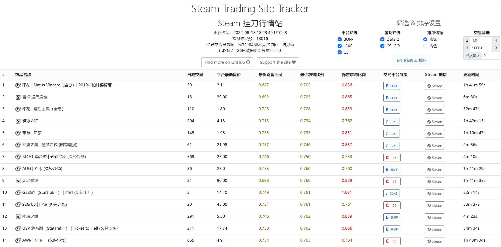

# SteamTradingSiteTracker

Steam 挂刀行情站 —— 全天候更新的 BUFF & IGXE & C5 挂刀比例数据

## 项目信息

:star: **站点访问地址：[https://www.iflow.work/](https://www.iflow.work/)** :star:

该项目的其他信息可参考 Keylol 社区页面：https://keylol.com/forum.php?mod=viewthread&tid=788489 。

目前 Web 服务器架设在香港，大部分地区可以正常访问。如站点无法连接 (e.g., `ERR_CONNECTION_RESET`)，请更换网络环境后重试。

**24小时持续更新物品比例数据**，受服务器成本限制，目前仅追踪 **BUFF & IGXE & C5** 三个主要平台售价 1 ~ 5000 元，满足特定规则的 **CSGO & DOTA2** 饰品皮肤（具体规则由[数据分析](https://github.com/EricZhu-42/SteamTradingSiteTracker/blob/main/SteamBuffSnapshot/demo.ipynb)得到；列表动态更新，当前约 13000 个）。

目前重点物品数据约 1.5h 完整更新一次，后期可能进一步提高更新频率。

为了服务器的正常运行，请不要在短时间内连续访问站点。

## 代码

**饰品数据更新**相关的[代码](https://github.com/EricZhu-42/SteamTradingSiteTracker/tree/main/scripts)已开源。

## 数据仓库
为了方便在主仓库上的 clone, watch 等操作，与数据集相关的文件自 2022/07/01 起被迁移至独立的[数据仓库](https://github.com/EricZhu-42/SteamTradingSiteTracker-Data)。

## 数据集

为了获得最优的饰品筛选规则，以获得包含尽可能多低比例饰品且尽量小的饰品追踪列表，本项目构造了 [SteamBuffSnapshot](https://github.com/EricZhu-42/SteamTradingSiteTracker-Data/tree/main/SteamBuffSnapshot) 数据集。

该数据集包含了 2022 年 2 月 14 日 BUFF 平台 dota2 与 csgo 所有饰品的价格数据与对应的 Steam Market 数据，共计 **38075** 条。

## Data Dumps

从 2022/4/25 起，可以在 [DataDumps](https://github.com/EricZhu-42/SteamTradingSiteTracker-Data/tree/main/DataDumps) 目录下获取 7 天前的 DATA 数据库的完整内容。

Data dumps 将作为 _SteamBuffSnapshot_ 数据集的补充，便于开发者在更长的时间周期内进行数据分析。

## 开发计划

### 数据更新

- [x] 优化更新调度算法，计算物品**寄售比例**与**求购比例**（时效性更强，权重更高）的加权和，设置分层优先级，提高重点物品的更新频率
- [x] 每小时并行更新一次加权比例前100的物品，确保重点物品更新时间不超过1h
- [x] 优化追踪列表筛选规则（包含了胶囊等低价高交易量物品）
- [ ] 增加站点监控功能，服务器离线或更新停止时发出通知 

### UI

- [x] 支持翻页功能
- [x] 支持按游戏筛选
- [x] 增加表格 `thead` 的底部阴影，使其在滚动时更美观
- [ ] 支持按比例由高到低排序（便于反向挂刀出余额）
- [ ] 支持按售价/交易量排序
- [ ] 移动端显示适配优化
- [ ] 前端美化

### 后端

- [x] 进一步完善排序/筛选方法

### 其他

- [x] 支持 DOTA2
- [x] 支持 IGXE
- [x] 支持 C5

